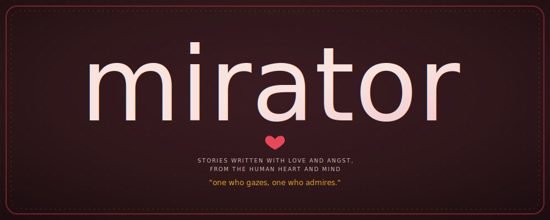

<div align="center">
  

  <p><em>lat. <strong>mirator</strong>, noun — one who gazes, one who admires.</em></p>

  [](https://mirator.amor-omnia.org)
  [](#)
  [](#)

</div>

<br>

**mirator** is a small, hand-kept archive of fanfiction and original fiction — no algorithm, no feed, no follower count. This repo is the source for [mirator.amor-omnia.org](https://mirator.amor-omnia.org).

<br>

## color palette

*Mirator* — the one who gazes, who admires — is a word for looking at something so long you stop noticing you're doing it. The palette follows: candlelight and old wine, nothing bright enough to break the spell. Sampled directly from the site's own `:root` (identical across every page):

| swatch | name | hex | used for |
|---|---|---|---|
|  | ink | `#221014` | `--bg` |
|  | wax | `#2f171a` | `--panel` |
|  | claret | `#B03039` | `--red` |
|  | rose | `#e8475a` | `--pink` |
|  | candlelight | `#e0a030` | `--gold` |
|  | parchment | `#f2e2dc` | `--cream` |
|  | dust | `#d8bcb8` | `--text-dim` |

```css
:root{
  --bg:#221014; --panel:#2f171a; --red:#B03039; --pink:#e8475a;
  --gold:#e0a030; --cream:#f2e2dc; --text-dim:#d8bcb8;
}
```

<br>

## adding a story

Write markdown into `stories-source/`, then `node build.js`. Regenerates every story page + the index. Safe to re-run anytime.

Chapters: add `chapters: true`, split body with `## Chapter Title | Date`. Leave the date off an unposted chapter and it shows dimmed in the nav.

`tags:` → `new, gen, fluff, pwp, angst, lime, lemon, grapefruit, xxx, oc`

**AO3 import:** `node ao3-to-markdown.js path/to/work.html` → writes into `stories-source/`. Tags and chapter dates aren't guessed — check the output before building.
